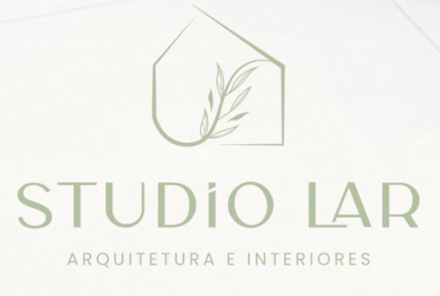

# Studio Lar - Arquitetura e Design



Uma landing page elegante e funcional para o escritório de arquitetura **Studio Lar**, das arquitetas **Giovana Nogueira** e **Amanda Rocha**. O escritório está localizado em **Cariacica-ES**, mas atende **clientes de todo o Brasil**.

## 🎯 Objetivo

Capturar informações básicas de potenciais clientes por meio de um **formulário simples**, redirecionando-os diretamente para o **WhatsApp** com uma **mensagem pré-preenchida contendo os dados enviados**.

## 🌟 Funcionalidades

- Design moderno e elegante
- Layout totalmente responsivo para todos os dispositivos
- Galeria de projetos com slideshow
- Formulário de contato com validação
- Redirecionamento para WhatsApp com mensagem automática
- Animações suaves para melhor experiência do usuário
- Botão "voltar ao topo"

## 💻 Tecnologias Utilizadas

- HTML5
- CSS3 (estilo responsivo com media queries)
- JavaScript vanilla
- Google Fonts (Merriweather)
- Feather Icons

## 🛠️ Instalação

1. Clone o repositório:
   ```
   git clone https://github.com/seuusuario/StudioLar.git
   ```

2. Navegue até a pasta do projeto:
   ```
   cd StudioLar
   ```

3. Abra o arquivo `index.html` em seu navegador ou utilize um servidor local.

## 📋 Estrutura do Projeto

```
StudioLar/
├── src/
│   ├── css/
│   │   └── styles.css
│   ├── js/
│   │   └── main.js
│   └── img/
│       ├── logo.jpeg
│       └── [imagens dos projetos]
├── index.html
└── README.md
```

## 🎨 Identidade Visual

- **Paleta de Cores:**
  - Verde Principal: #54603C
  - Verde Escuro: #3E472C
  - Verde Claro: #6B784C
  - Cor de Texto: #848A72
  - Cor de Texto Secundário: #696969
  - Fundo: #FCFCF7
  - Destaque: #D4B996

- **Fonte:** Merriweather (serif)

## 📱 Responsividade

A landing page é totalmente responsiva, adaptando-se perfeitamente a desktops, tablets e smartphones, garantindo uma experiência consistente para todos os usuários.

## 📱 Contato

Para entrar em contato com o Studio Lar:
- WhatsApp: (27) 99999-9999
- Email: contato@studiolar.com.br
- Instagram: @studio.lar

## 📄 Licença

Este projeto está licenciado sob a licença MIT - veja o arquivo LICENSE.md para detalhes.

---

Desenvolvido com ❤️ em 2024. 